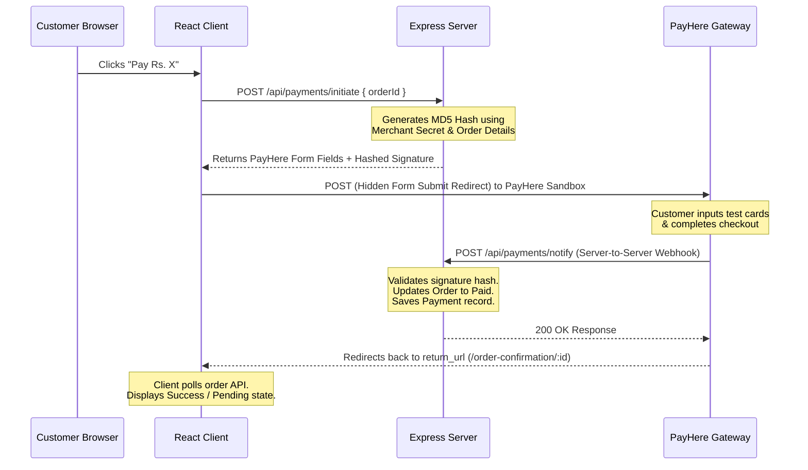

# 🍔 Feast & Flow

A premium, full-stack food ordering and delivery management system built with the **MERN** stack and integrated with **PayHere Sandbox** for secure, real-time online payments (LKR).

Feast & Flow is designed to serve two primary user flows: **Customers** who want to browse menus, add items to their carts, and checkout securely; and **Admins** who need full lifecycle control over foods, orders, customer registries, and payment reconciliation.

---

## 🚀 Key Highlights

*   **⚡ Real-Time Checkout Flow**: Integrated with Sri Lanka's leading payment gateway **PayHere** using secure MD5 signature validation.
*   **💼 Admin Command Center**: Comprehensive control panel showing earnings, order volumes, customer data, and item statuses.
*   **🔐 JWT Authentication**: Structured authorization guards separating admin capabilities from customers.
*   **📁 File System Uploads**: Integrated image uploads using **Multer** for dynamic, visual menu creations.
*   **🎨 Clean & Adaptive UI**: Styled with clean, modern React inline-styles for speed, visual appeal, and responsiveness.

---

## 🛠️ Technology Stack

| Layer | Technology | Purpose |
| :--- | :--- | :--- |
| **Frontend** | React (v19) | Dynamic client-side UI, state contexts, and order styling |
| **Routing** | React Router Dom (v7) | Declarative layout paths & private authentication route guards |
| **Backend** | Node.js / Express | REST API, security middleware, and transaction processing |
| **Database** | MongoDB / Mongoose | Schema mapping for food catalogs, orders, payments, and users |
| **Uploads** | Multer | Disk-storage processing of food item images |
| **Payments** | PayHere Checkout API | Merchant integrations, checkout forms, and webhook handlers |
| **Security** | JSON Web Tokens & BcryptJS | JWT authorization, bearer headers, and salted password hashes |

---

## 📁 Project Directory Structure

```filepath
food-ordering/
├── client/                 # React Frontend
│   ├── public/             # Static public assets
│   └── src/
│       ├── api/            # Axios API config with JWT interceptors
│       ├── components/     # UI Components (Navbar)
│       ├── context/        # React Contexts (AuthContext, CartContext)
│       └── pages/
│           ├── Admin/      # Admin Panel (Dashboard, Orders, Foods, Payments)
│           ├── Cart.jsx    # Shopping Cart list
│           ├── Checkout.jsx# Checkout page & PayHere hidden redirect form
│           └── ...         # Auth & Order confirmations
└── server/                 # Express Backend
    ├── middleware/         # Auth & role-based validation middleware
    ├── models/             # Mongoose Schemas (User, FoodItem, Order, Payment)
    ├── routes/             # REST endpoints (auth, admin, foods, orders, payments)
    ├── uploads/            # Server static directory for food images
    ├── index.js            # Express Entrypoint & DB connection
    └── seed.js             # Initial Admin and Food Item database seeder
```

---

## ⚡ Quick Start

### 1. Prerequisites
Ensure you have the following installed on your machine:
*   [Node.js](https://nodejs.org/) (v16+)
*   [MongoDB Atlas](https://www.mongodb.com/cloud/atlas) or a local running MongoDB instance.
*   An active [PayHere Sandbox Account](https://www.payhere.lk/) to obtain test credentials.

---

### 2. Setting Up the Backend
1. Navigate to the `server` directory:
   ```bash
   cd server
   ```
2. Install the server-side dependencies:
   ```bash
   npm install
   ```
3. Create a `.env` file in the root of the `/server` folder using the template below:
   ```env
   PORT=5000
   MONGO_URI=your_mongodb_connection_string
   JWT_SECRET=your_super_secret_jwt_key

   # PayHere Settings (Sandbox)
   PAYHERE_MERCHANT_ID=your_merchant_id
   PAYHERE_MERCHANT_SECRET=your_merchant_secret
   PAYHERE_BASE_URL=https://sandbox.payhere.lk/pay/checkout

   # Frontend and Ngrok URLs (for local callbacks)
   CLIENT_URL=http://localhost:3000
   SERVER_URL=https://your-ngrok-free-tunnel.dev
   ```
   > [!IMPORTANT]
   > PayHere sends transaction status updates asynchronously to the server via `/api/payments/notify`. Because PayHere cannot communicate with `localhost`, you must use a tunneling tool like **ngrok** to expose your local server and assign its public URL to the `SERVER_URL` variable.

4. Seed the database with food items and default administrator accounts:
   ```bash
   node seed.js
   ```
5. Start the backend server:
   ```bash
   npx nodemon index.js
   ```

---

### 3. Setting Up the Frontend
1. Open a new terminal and navigate to the `client` directory:
   ```bash
   cd ../client
   ```
2. Install frontend dependencies:
   ```bash
   npm install
   ```
3. Launch the React development server:
   ```bash
   npm start
   ```
4. Open [http://localhost:3000](http://localhost:3000) in your web browser.

---

## 🔒 Default Login Credentials

After running the database seeder (`seed.js`), you can immediately log in with these roles:

*   **Administrator**:
    *   **Email**: `admin@food.com`
    *   **Password**: `admin123`
*   **Customer**:
    *   Navigate to the registration screen in the client app to register dynamic customer profiles.

---

## 💳 PayHere Payment Integration Workflow

Feast & Flow handles payments using a secure, client-server handshake with PayHere Checkout:



### Hashing Formula (MD5 Sig verification)
To prevent tampering with order values or statuses, signature checks are run on both initiation and webhook callbacks.
*   **On Initiation**: 
    ```js
    const hash = md5(`${merchantId}${orderId}${amount}${currency}${md5(merchantSecret)}`);
    ```
*   **On Callback Notification**:
    ```js
    const localHash = md5(`${merchant_id}${order_id}${payhere_amount}${payhere_currency}${status_code}${md5(merchantSecret)}`);
    ```

---

## 📡 Core API Reference

### 🔐 Authentication
*   `POST /api/auth/register` - Create a new user profile.
*   `POST /api/auth/login` - Authenticate customer/admin credentials and obtain JWT.
*   `GET /api/auth/me` - Fetch profile metadata for logged-in user.

### 🍔 Menu & Foods
*   `GET /api/foods` - Query list of food items (supports filter by `category` or `search`).
*   `GET /api/foods/:id` - Fetch details for a specific food item.
*   `POST /api/foods` - **[Admin Only]** Add a new food item with form-data (including image).
*   `PUT /api/foods/:id` - **[Admin Only]** Modify details or update image for a food item.
*   `DELETE /api/foods/:id` - **[Admin Only]** Permanently delete a food item from the menu.

### 📝 Orders
*   `POST /api/orders` - Initialize an order containing cart items, instructions, and delivery details.
*   `GET /api/orders` - Retrieve list of orders matching the authenticated user.
*   `GET /api/orders/:id` - View item lists, payment statuses, and tracking steps for a specific order.

### 💳 Payments
*   `POST /api/payments/initiate` - Securely generate PayHere request signatures and forms parameters.
*   `POST /api/payments/notify` - **[Webhook]** Callback notification called by PayHere to update payment logs.
*   `GET /api/payments` - **[Admin Only]** Query complete ledger list of all processed payments.

### 📊 Admin Analytics
*   `GET /api/admin/dashboard` - **[Admin Only]** Returns metrics for total orders, revenue, user counts, and recent orders.
*   `GET /api/admin/customers` - **[Admin Only]** Lists customers with their registered details and total orders completed.

---

## 🤝 Contributing
Contributions, bug reports, and features are welcome! Feel free to open issues or pull requests. Enjoy your food! 🍕
